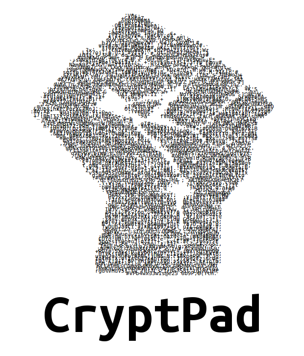

---

(The **Zero-Knowledge** Realtime Visual Editor)

---
# What's wrong with Realtime?

--
- The standard is known as Operational Transformation

--
- Complexity grows cumulatively

--
- It's not portable

--
- Lots of calculation happens on the server

---
# ChainPad

--
- Keep everything in the browser

--
- Nakamoto Blockchain

--
- The server is a simple message relay server

--
- *Future research*: Can we eliminate the server entirely?

---
# How this differs from EtherPad

--
- Operational Transformation is carried out in the browser which makes the changes

--
- Works directly on the DOM, Operational Transform is carried out on HTML

--
- Works with any editor

--
- Very little server code

---
# CryptPad

--
- 2 days of furious hacking

--
- ChainPad + Cryptography -> **Zero-Knowledge**

--
- Put the key in the URL hash

--
- E.G. http://web.site/#AXFpHr6pGwB6dRyFGXN5Rfby

--
- Server code ported from Java to NodeJS

--
- Client ported from XWiki WYSIWYG to CKEditor

---
# demo

- https://cryptpad.fr/#seabeyond
- This is not a very secure key but you can type it on your laptop :)

---
# It ain't over

- https://cryptpad.fr/#seabeyond

--
- Collaborative drawing

--
- Get rid of the server

--
- Can we have more tools for collaborative decent?

---

--

- Questions?
- Source: https://github.com/cjdelisle/cryptpad
- https://cryptpad.fr/#seabeyond

